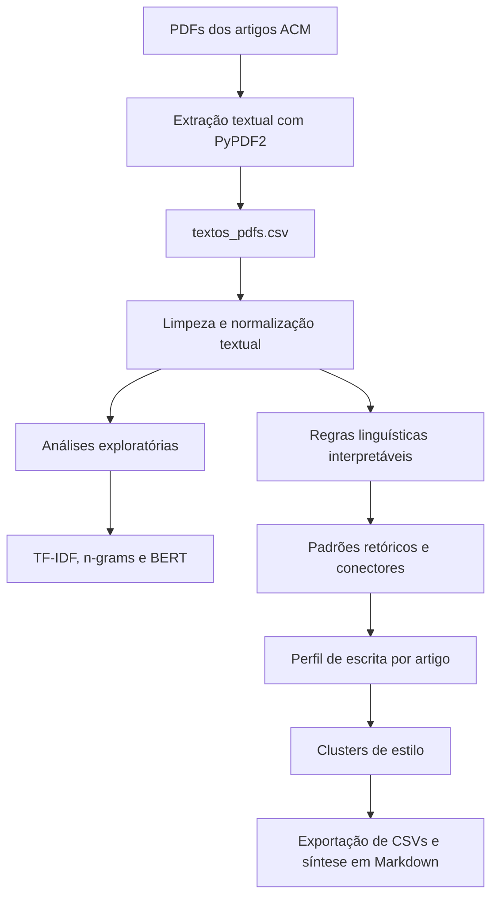

# 📚 Dissertação de Mestrado — Padrões de Escrita Científica em Artigos de Computação

Projeto de dissertação voltado à análise automática de padrões de escrita científica em artigos da área de Computação, com foco em extração textual, exploração lexical, análise temática e identificação de movimentos retóricos por meio de regras linguísticas interpretáveis.

## 🎯 Objetivo

Investigar padrões gerais de escrita científica em um corpus de artigos acadêmicos da ACM, observando como os textos apresentam contexto, lacunas, objetivos, métodos, resultados, conclusões, conectores discursivos e perfis de estilo.

A proposta central é priorizar uma abordagem interpretável baseada em regras linguísticas, usando técnicas como TF-IDF, n-grams e embeddings BERT como apoio exploratório ou baseline.

## 🧾 Corpus analisado

O corpus contém **800 artigos científicos** extraídos de periódicos da ACM, organizados principalmente entre **2021 e 2024**.

| Ano | Quantidade | Percentual aproximado |
|---:|---:|---:|
| 2021 | 8 | 1,00% |
| 2022 | 41 | 5,13% |
| 2023 | 130 | 16,25% |
| 2024 | 621 | 77,63% |

### 🗂️ Periódicos contemplados

- ACM Computing Surveys
- ACM Transactions on Computing Education
- ACM Transactions on Graphics
- ACM Transactions on Intelligent Systems and Technology
- ACM Transactions on Internet Technology
- ACM Transactions on Multimedia Computing, Communications and Applications
- ACM Transactions on Software Engineering and Methodology
- ACM Transactions on Spatial Algorithms and Systems

## 🧪 Arquivos

| Arquivo | Função no projeto |
|---|---|
| `leitura_pdfs_transformar_csv.ipynb` | Extrai texto dos PDFs com PyPDF2 e gera a base `textos_pdfs.csv`. |
| `análises_iniciais_mestrado.ipynb` | Resume a distribuição dos artigos por periódico e ano. |
| `analises_artigos_csv.ipynb` | Faz análises exploratórias: limpeza textual, top words, keywords, n-grams, seções, TF-IDF, BERT e métricas iniciais de estilo. |
| `pipeline_padroes_gerais_escrita_cientifica.ipynb` | Implementa o pipeline principal de padrões retóricos, conectores, perfis de escrita, clustering por estilo e exportação dos resultados. |

## ⚙️ Pipeline geral

## 🧹 Pré-processamento

As etapas de limpeza incluem:

- remoção de quebras de linha e múltiplos espaços;
- correção de ruídos de extração, como `hps`;
- remoção de URLs, DOI, metadados editoriais e fragmentos ACM recorrentes;
- remoção aproximada de referências, bibliografia e agradecimentos;
- segmentação do texto em sentenças;
- filtragem de sentenças muito curtas ou ruidosas.

## 🔎 Análises exploratórias

O notebook `analises_artigos_csv.ipynb` executa análises iniciais para compreender o corpus.

### 🧠 Top keywords normalizadas

As principais keywords identificadas incluem:

- deep learning
- machine learning
- federated learning
- privacy
- blockchain
- covid-19
- recommender systems
- security
- software testing
- neural networks
- internet of things

### 🧩 N-grams frequentes

Entre os bigrams relevantes aparecem:

- computer science
- neural networks
- computing education
- software engineering
- deep learning
- machine learning
- computer vision
- real world
- artificial intelligence
- state art

### 🧭 Frequência de seções

A busca por marcadores de seção retornou maior presença de:

| Seção | Frequência |
|---|---:|
| methods | 19.100 |
| results | 10.435 |
| background | 1.006 |
| discussion | 767 |
| abstract | 655 |
| introduction | 465 |
| conclusion | 459 |
| related work | 226 |
| related reviews | 10 |

## 📊 Baseline com TF-IDF

O TF-IDF é usado como baseline lexical para identificar termos distintivos no corpus.

Top termos por score médio:

| Termo | Score |
|---|---:|
| image | 0,047188 |
| students | 0,041053 |
| education | 0,032775 |
| graph | 0,031953 |
| user | 0,030161 |
| code | 0,029313 |
| detection | 0,029211 |
| images | 0,028451 |
| software | 0,026677 |
| video | 0,025395 |
| spatial | 0,024668 |
| privacy | 0,023162 |
| security | 0,020535 |
| temporal | 0,020365 |
| edge | 0,020236 |

## 🤖 Análise temática com embeddings BERT

O notebook utiliza `sentence-transformers/all-MiniLM-L6-v2` para gerar embeddings dos artigos e aplicar KMeans com **5 clusters**.

Os grupos encontrados indicam temas como:

| Cluster | Interpretação aproximada |
|---:|---|
| 0 | Educação em Computação, ensino, programação, professores e estudantes. |
| 1 | Gráficos, imagens, vídeo, multimídia e aplicações 3D. |
| 2 | Algoritmos espaciais, grafos, predição, modelos temporais e sistemas. |
| 3 | Federated learning, privacidade, segurança, IoT, redes e edge computing. |
| 4 | Engenharia de software, código, testes, modelos e tecnologia. |

Essa etapa funciona como análise temática auxiliar, distinta do pipeline principal de escrita.

## 🧱 Pipeline principal: padrões gerais de escrita científica

O notebook `pipeline_padroes_gerais_escrita_cientifica.ipynb` é o núcleo metodológico mais maduro do projeto.

Ele analisa o texto completo dos artigos sem separar por seção, usando sentenças como unidade de análise.

### 🧬 Padrões retóricos detectados

Os rótulos principais são:

- `contextualizacao`
- `lacuna_problema`
- `objetivo_contribuicao`
- `metodo_procedimento`
- `resultado_achado`
- `implicacao_conclusao`
- `limitacao_futuro`
- `sem_marcador_explicito`

### 🔗 Tipos de conectores

O pipeline também classifica conectores por função discursiva:

- adição
- contraste
- causa e efeito
- sequência
- exemplo
- comparação
- condição
- ênfase

## 📌 Resultados principais

Foram analisados **800 artigos** e **232.355 sentenças válidas**.

### 🧾 Distribuição dos padrões retóricos

| Padrão retórico | Sentenças | Percentual |
|---|---:|---:|
| sem_marcador_explicito | 158.312 | 68,13% |
| metodo_procedimento | 23.788 | 10,24% |
| lacuna_problema | 21.528 | 9,27% |
| resultado_achado | 14.809 | 6,37% |
| implicacao_conclusao | 7.144 | 3,07% |
| objetivo_contribuicao | 3.086 | 1,33% |
| contextualizacao | 1.875 | 0,81% |
| limitacao_futuro | 1.813 | 0,78% |

### 🔗 Conectores mais frequentes

| Tipo de conector | Frequência | Ocorrências por 1.000 sentenças |
|---|---:|---:|
| contraste | 24.530 | 105,57 |
| sequência | 24.100 | 103,72 |
| causa_efeito | 20.263 | 87,21 |
| adição | 19.160 | 82,46 |
| condição | 13.449 | 57,88 |
| exemplo | 13.183 | 56,74 |
| ênfase | 4.009 | 17,25 |
| comparação | 3.728 | 16,04 |

## ✍️ Perfis gerais de escrita por artigo

O pipeline agrega as sentenças por artigo para calcular indicadores como:

- número de sentenças;
- média e mediana de palavras por sentença;
- conectores por sentença;
- marcadores retóricos por sentença;
- percentual de primeira pessoa;
- percentual de modalização;
- aproximação de voz passiva;
- distribuição percentual dos padrões retóricos;
- taxa de conectores por 1.000 sentenças.

## 🧩 Clustering por estilo

O agrupamento por perfil de escrita utiliza KMeans sobre características agregadas por artigo.

O melhor valor encontrado foi **k = 2**, escolhido por silhouette.

| Cluster | Quantidade de artigos | Caracterização aproximada |
|---:|---:|---|
| 0 | 503 | Maior presença relativa de método, objetivo/contribuição e sentenças sem marcador explícito. |
| 1 | 297 | Maior uso de conectores, especialmente contraste, adição, causa e efeito, exemplo e condição; também maior presença de lacuna/problema. |

---

## 👤 Autor

Gabriel Evaristo
